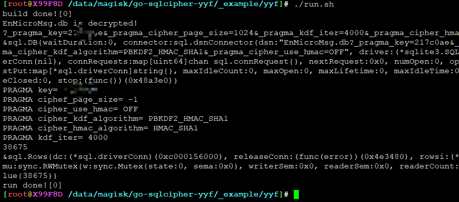
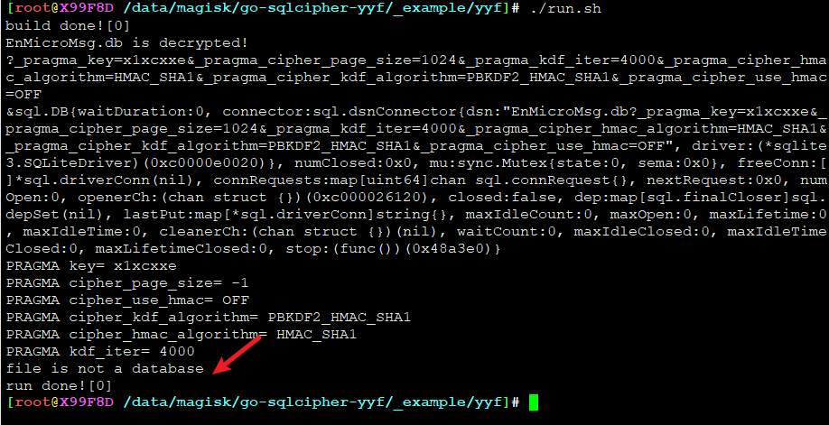

# go-sqlcipher for wechat db decrypt


## 原生sqlcipher解密EnMicroMsg.db的正确姿势

```
SQLCipher version 3.8.4.3 2014-04-03 16:53:12
Enter ".help" for instructions
Enter SQL statements terminated with a ";"
sqlite> PRAGMA key = 'this is EnMicroMsg.db password';
sqlite> PRAGMA cipher_page_size = 1024;
sqlite> PRAGMA kdf_iter = 4000;
sqlite> PRAGMA cipher_hmac_algorithm = HMAC_SHA1;
sqlite> PRAGMA cipher_kdf_algorithm = PBKDF2_HMAC_SHA1;
sqlite> PRAGMA cipher_use_hmac = OFF;
```

到此，已解密。导出解密后的数据库(可选，不导出也能继续执行CRUD SQL)

```
sqlite> ATTACH DATABASE 'plaintext.db' AS plaintext KEY '';
sqlite> SELECT sqlcipher_export('plaintext');
sqlite> DETACH DATABASE plaintext;
```


## 使用指南

* 上游go-sqlcipher对PRAGMA支持不够，二次开发增加一下，顺便看看源码
* 新增微信解密所需PRAGMA支持
* golang本身支持跨平台，编译选项指定一下，不论你是android armXX还是x86、MIPS，**通吃**，全都要


光速入门:

```
package main
import (
	"database/sql"
	"errors"
	"fmt"
	sqlite3 "github.com/yifengyou/go-sqlcipher"
)


func main() {
	databasefile := "EnMicroMsg.db"

	encrypted, err := sqlite3.IsEncrypted(databasefile)
	if err != nil {
		panic(err)
	}
	if !encrypted {
		panic(errors.New("go-sqlcipher: DB not encrypted"))
	}
	fmt.Println(databasefile, "is decrypted!")
	parameters := "?_pragma_key=XXXXX&_pragma_cipher_page_size=1024&_pragma_kdf_iter=4000&_pragma_cipher_hmac_algorithm=HMAC_SHA1&_pragma_cipher_kdf_algorithm=PBKDF2_HMAC_SHA1&_pragma_cipher_use_hmac=OFF"
	fmt.Println(parameters)
	db, err := sql.Open("sqlite3", databasefile+parameters)
	if nil != err {
		panic(err.Error())
	}
	defer db.Close()
	fmt.Printf("%#v\n", db)


	sqlStmt := "select count(*) from message"
	res , err := db.Query(sqlStmt)
	if err != nil {
		fmt.Println(err.Error())
		return
	}
	for res.Next() {
		var id int
		err = res.Scan(&id)
		if nil != err {
			panic(err.Error())
		}
		fmt.Println(id)
	}
	fmt.Printf("%#v\n", res)
}
```

* 请将 XXXXX 改成数据库密码，密码获取方式，请科学上网检索

执行输出如下：

其中 38675 是当前微信db中所有聊天记录（包括群聊）的数量（每条消息一条SQL记录）



如果显示```file is not a database```，则说明密码错了，要么就是微信换了算法，到时候再说吧，至少目前**微信8.0.21**是Ok的。




---
